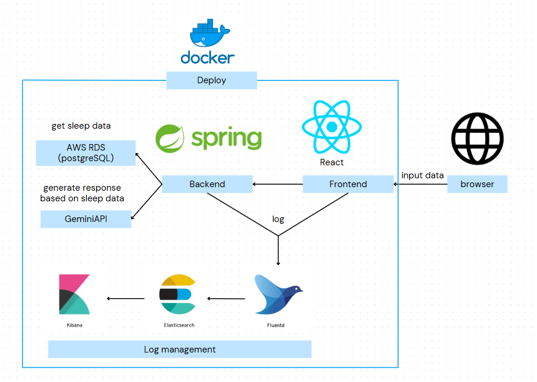
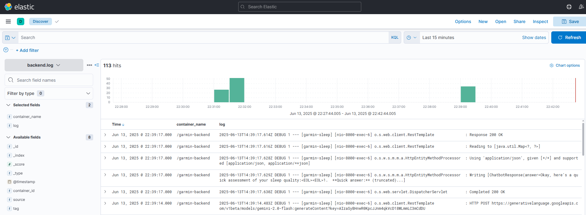
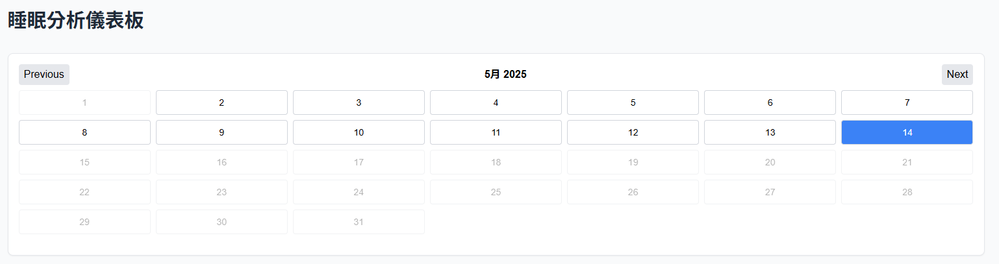
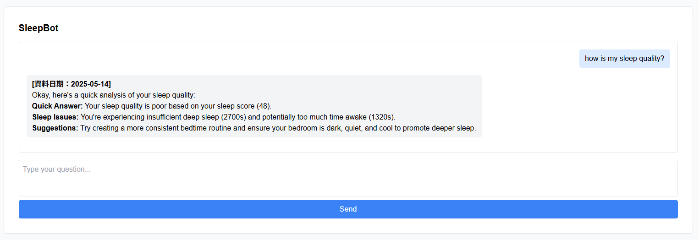
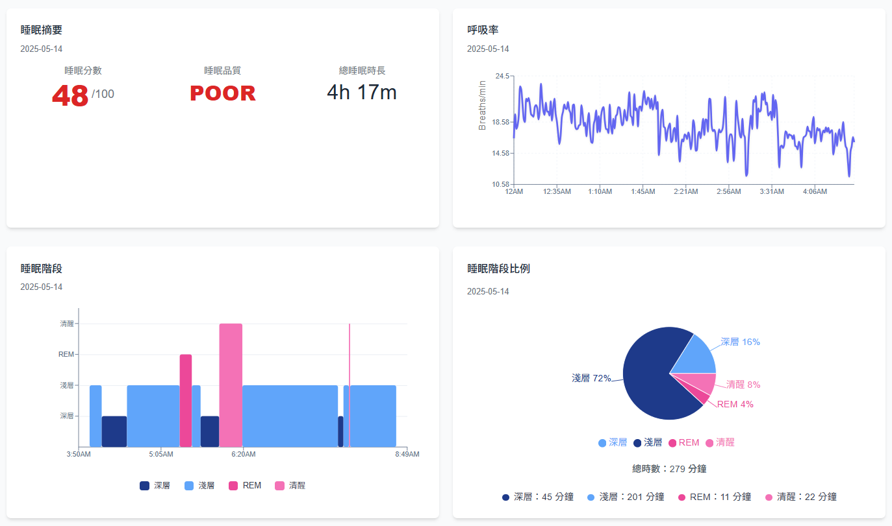
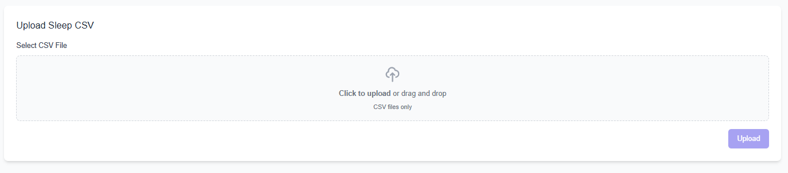

SleepGenius
===

一個整合 **Garmin** 睡眠資料與 **Gemini API** 的互動式睡眠分析聊天機器人。

## 📌 專案簡介

SleepGenius 是一套以健康自我管理為目標的個人化睡眠分析系統，透過 **Garmin API** 擷取穿戴裝置的睡眠資料，再經由 **Gemini API** 進行自然語言分析，提供清晰易懂的建議與圖表化報告。透過 **聊天式介面** 提升互動性，並以 **Docker** 部署及 **EFK Stack** 進行日誌監控，達成可維運性高且資料安全的分析平台。

## 🧠 核心技術架構

### 後端（Spring Boot + Gemini + AWS RDS）
- 使用 Spring Boot 架設 RESTful API
- 儲存睡眠資料於 AWS RDS（PostgreSQL）
- 呼叫 Gemini API 回傳分析建議

### 前端（React）
- 支援日期查詢、視覺化圖表、聊天式問答、CSV 上傳
- 與後端 API 互動並呈現結果

### 部署與監控（Docker Compose + EFK）
- 所有模組容器化並透過 Docker Compose 協調
- 使用 EFK Stack（Elasticsearch + Fluentd + Kibana）實現即時監控與錯誤追蹤

### 📈 系統架構圖

### EFK

## 🛠️ 功能特色

### 📅 日期選擇器
- 使用者可透過日曆選取有紀錄的日期
- 自動篩選避免查詢無效資料

### 💬 Chatbot 問答
- 輸入自然語言問題（例如：「我昨天睡得怎麼樣？」）
- 呼叫 Gemini 回傳個人化分析與建議

### 📊 睡眠圖表
- 長條圖或區段圖顯示當日入睡時間、清醒時間、各階段佔比等資訊

### 📁 CSV 上傳
- 支援手動上傳 Garmin 睡眠資料（CSV 格式）
- 自動儲存進資料庫並整合分析流程

## 頁面展示

### 日期選擇器

### Chatbot 問答

### 睡眠圖表

### CSV 上傳

## 🔭 未來展望

* **更多生理資料整合**：心率、血氧、HRV、Body Battery
* **跨日查詢分析**：如「我睡得最好的一週是什麼時候？」
* **即時資料串流與自動化**：與 Garmin 簽約後可串接即時資料、實現無人工上傳